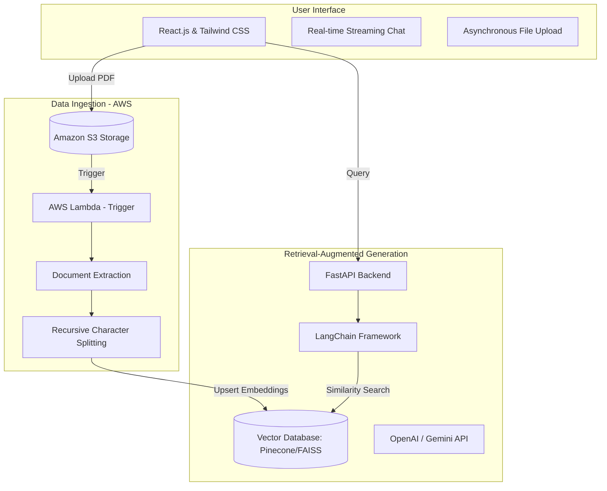

```mermaid
graph TD
    subgraph Frontend_Layer [User Interface]
        UI[React.js & Tailwind CSS]
        Chat[Real-time Streaming Chat]
        Upload[Asynchronous File Upload]
    end

    subgraph Serverless_Ingestion [Data Ingestion - AWS]
        S3[(Amazon S3 Storage)]
        Lambda[AWS Lambda - Trigger]
        Extract[Document Extraction]
        Chunking[Recursive Character Splitting]
    end

    subgraph RAG_Pipeline [Retrieval-Augmented Generation]
        FastAPI[FastAPI Backend]
        LC[LangChain Framework]
        VectorDB[(Vector Database: Pinecone/FAISS)]
        LLM[OpenAI / Gemini API]
    end

    UI -->|Upload PDF| S3
    S3 -->|Trigger| Lambda
    Lambda --> Extract
    Extract --> Chunking
    Chunking -->|Upsert Embeddings| VectorDB

    UI -->|Query| FastAPI
    FastAPI --> LC
    LC -->|Similarity Search| VectorDB
```
    VectorDB -->|Context Retrieval| LC
    LC -->|Context + Prompt| LLM
    LLM -->|Streamed Response| UI
